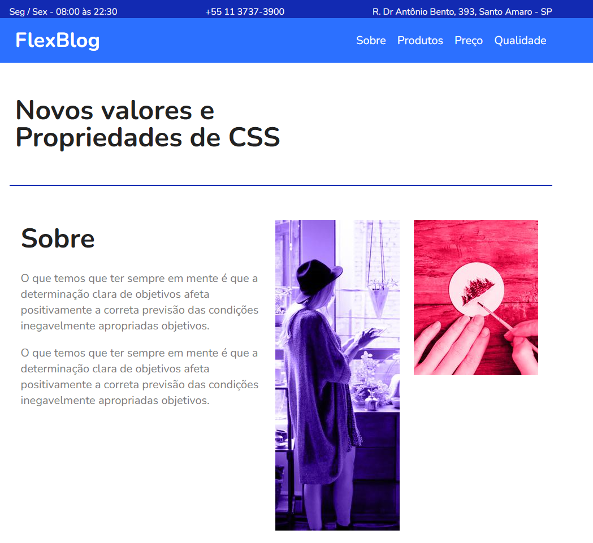
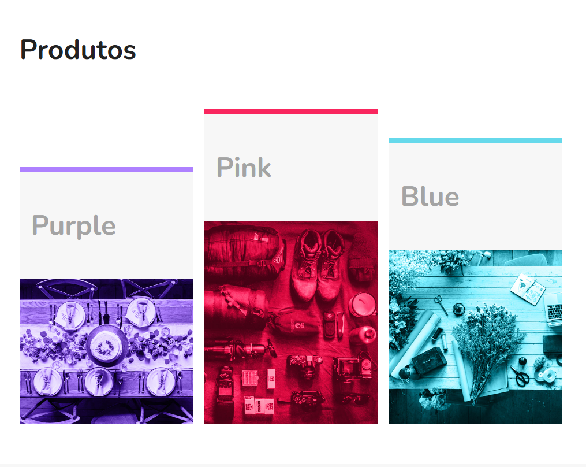
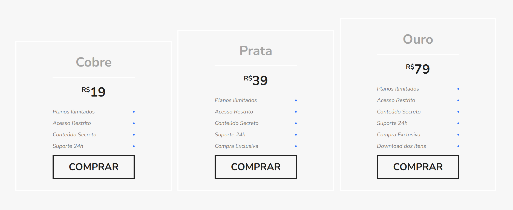
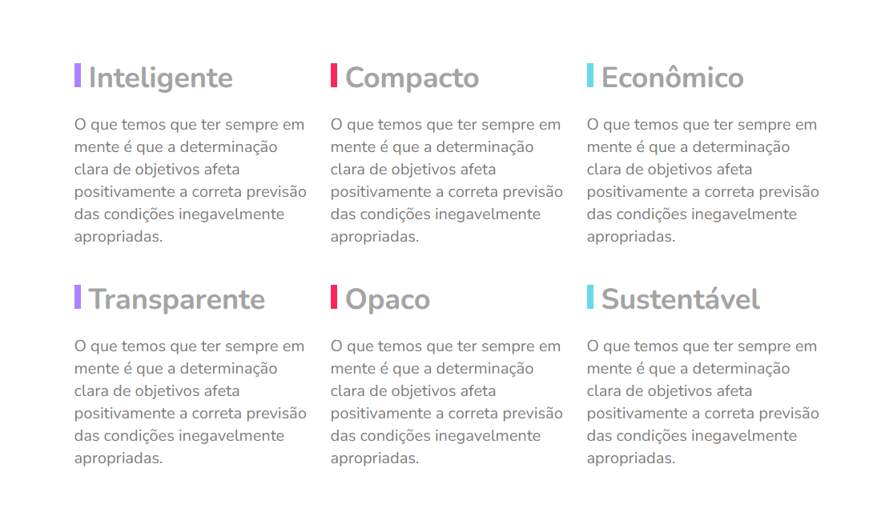

# 📂 FlexBlog

- Site utilizado para estudar flexbox

_Flexbox_ é uma tecnologia de layout de elementos em HTML e CSS que permite a criação de layouts flexíveis e responsivos. Com Flexbox, você pode criar layouts que se adaptam automaticamente às diferentes

📌Projeto FlexBlog desenvolvido por Alex

-HTML e CSS ✅
-Flexbox ✅
-Responsividade com flexbox ✅

## Considerações finais
Projeto Finalizado

